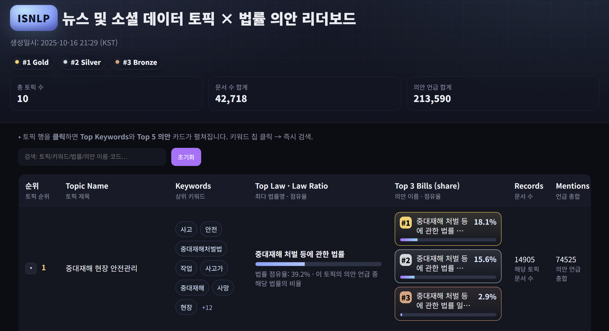

# ⚖️ 뉴스 및 소셜 데이터 토픽 × 법률 의안 리더보드 프로젝트



최근 다양한 매체에서 법률 관련 여론이 대량으로 생성되지만, 개별 여론이 입법 과정에 직접 반영되기 어렵습니다. 

때문에 이 프로젝트에서는 방대한 뉴스·SNS 데이터를 **신속·정확**하게 분석해 국민의 법률 제·개정 요구를 선제적으로 파악하는 **AI 입법 수요 분석 서비스 모델**을 목표로 합니다.

뉴스·SNS에서 터지는 이슈(토픽)가 **어떤 법률/의안과 연결되는지 한눈에 보여주는 대시보드**를 제시하는 것을 통해 정책·입법 수요를 "데이터로" 파악하는 실험을 진행했습니다.

이를 통해 국회의원과 같은 입법 관련자가 의안이나 법안에 대한 입법 우선순위를 파악하는 것을 지원합니다.

---

## 왜 이걸 만들었나 (Background & Purpose)
- **담론 ↔ 입법 간격**: 여론의 강도·추세가 입법 우선순위로 이어지기까지의 단절을 줄입니다.
- **규모 문제**: 사람이 전수 확인하기 어려운 대규모 비정형 텍스트를 자동 분석합니다.

---

## 한 줄 요약 (What it does)
- **토픽 → 법률/의안 매칭**: 이슈가 생기면 관련 법률/의안 후보를 자동으로 찾아준다.
- **토픽별 메이저 법률**: 토픽 내부에서 가장 많이/강하게 연결되는 "핵심 법률 의안"을 뽑아준다.
- **리더보드**: 토픽 카드 + Top 법률/의안 + 키워드/개요를 **정적 HTML**로 시각화한다.

---

## 어떻게 동작하는가? (How it work)
1) **토픽화**된 뉴스·SNS를 입력으로 받는다.  
2) 공개 API/의안 메타로부터 **법률/의안 요약**을 만든다.  
3) `Qwen3-Embedding-8B + LoRA` 듀얼인코더로 **이슈 ↔ 법률/의안 유사도**를 계산한다.  
4) 토픽 내부에서 **메이저 법률/Top 의안**을 집계한다.  
5) 결과를 **정적 리더보드(HTML)** 로 뽑아 공유한다.

간단 구조도:
```
[토픽 뉴스/SNS] ──▶ [임베딩/매칭] ──▶ [토픽별 메이저 법률·Top 의안]
        ▲                     │
        │                     ▼
   [의안 메타/요약] ◀────── [집계/리더보드]
```

---

## 주요 산출물 (Outputs)
- **토픽 카드**: 토픽명/키워드/간단 개요
- **메이저 법률**: 토픽과 가장 강하게 연결된 법률 의안 1~N개
- **Top 의안 리스트**: 법률별 대표 의안(요약/점수/링크)
- **정적 HTML 리더보드**: 공유·호스팅 쉬운 단일 HTML

---

## 누가 쓰면 좋은가 (For whom)
- **정책/입법 기획**: 빠르게 "지금 중요한 법률 의안"을 파악하고 근거 자료에 접근
- **데이터 저널리즘**: 이슈-법률 의안 연결을 시각적으로 설명
- **리서처/학생**: 담론과 제도 변화의 상관을 정량적으로 관찰

---

## 데모 방법
실데이터 없이 **형식만** 확인하려면:
```bash
# 1) 의안 메타(공개 가능) 수집
python src/00_ingest/billinfo_fetch_and_merge_with_cache.py \
  --service-key $BILL_API_KEY --start-date 20240101 --end-date 20251029 \
  --out data/external/billinfo_2024_2025.json

# 2) 의안 그룹 생성
python src/02_bill_groups/extract_law_groups.py \
  --in data/external/billinfo_2024_2025.json --out outputs/interim

# 3) 샘플 토픽 JSONL(모의)로 인퍼런스 → 집계 → 리더보드
# (news_sample.jsonl 은 사용자가 임의 문장으로 구성, 공개 가능)
python src/04_infer/infer_attach_bills.py \
  --input_path data/external/news_sample.jsonl \
  --bill_groups_path outputs/interim/bill_groups_with_summary.json \
  --ckpt_dir outputs/ckpts/run_qwen8b_lora \
  --out_dir outputs/predictions

python src/06_aggregate/aggregate_by_topic_top_law.py \
  --in outputs/predictions/enriched.json \
  --out-json outputs/interim/topic_toplaw.json

python src/07_leaderboard/build_leaderboard.py \
  --in outputs/interim/topic_toplaw.json \
  --out outputs/leaderboard/index.html
```

---
## 요약 성과 (Results Snapshot)
- 듀얼인코더 **파인튜닝 전/후** 리트리벌 성능:  
  - Recall@1: `0.127 → 0.617`  
  - Recall@5: `0.250 → 0.900`  
  - Recall@10: `0.321 → 0.928`  
  - MRR/MAP: `~0.745`  
- **Multi-Positive InfoNCE** + **trainable temperature** + **도메인 적응 LoRA** 조합이 큰 효과를 보이는 것을 확인 가능했습니다.
- 가볍게 LoRA를 통해 도메인 Knowledge를 튜닝시켜 주는 것이 유효해 보입니다.

---

## License
- License: MIT
